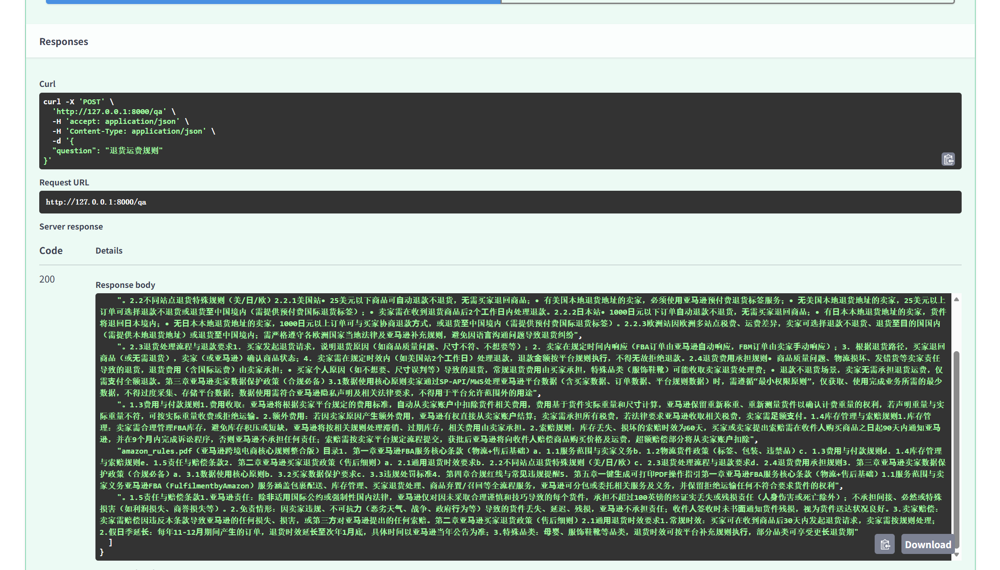
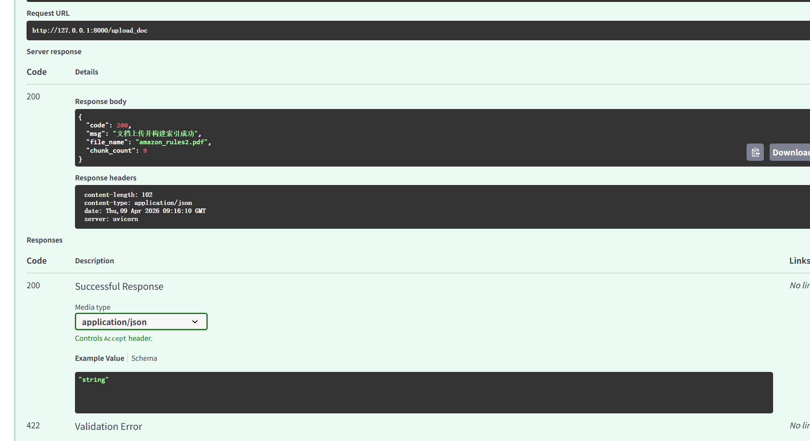

# RAG 企业私有知识库问答系统

**基于检索增强生成（RAG）的企业级私有知识库问答 API 服务**

支持 PDF / DOCX / TXT 文档上传、自动解析、文本分块、向量化、混合检索，并通过阿里云百炼大模型生成精准答案。

**前后端友好 | 开箱即用 | 支持 Docker 部署 | 支持本地 .env 配置**

## ✨ 项目亮点
- **多格式文档支持**：PDF / Word (.docx) / TXT 自动解析与文本清洗
- **智能文本分块**：基于标点、段落、长度智能切块，支持重叠上下文
- **混合检索引擎**：向量检索（语义匹配）+ BM25 关键词检索（精准匹配）
- **轻量中文向量模型**：使用 BGE-small-zh-v1.5，速度快、效果强、占用低
- **大模型答案生成**：基于阿里云百炼（通义千问），严格依据知识库，不编造
- **完整 RESTful API**：提供上传、问答、健康检查接口
- **环境兼容**：本地 .env + Docker 环境变量无缝兼容，一键切换
- **生产级稳定性**：异常捕获、空值校验、自动重试、错误提示友好
- **无前端依赖**：纯 API 服务，可对接任何前端、小程序、APP、钉钉机器人

## 🧠 系统架构
```markdown
用户上传文档 → 文档解析 → 文本清洗 → 智能分块 → 向量化 → 构建检索索引
用户提问 → 混合检索（向量+BM25）→ 大模型生成答案 → 返回 JSON 结果```

## 🚀 核心功能
**1. 文档上传与自动解析**
- 上传 PDF / Word / TXT
- 自动提取文本、清理乱码、多余空格、不可见字符
- 自动分块、去重、生成检索知识库
**2. 私有知识库检索**
- 向量检索：理解语义，智能匹配相似内容
- BM25 检索：关键词精准匹配
- 混合结果合并去重，返回最相关片段
**3. 智能问答（RAG）**
- 严格依据文档内容回答
- 无答案时返回：未找到相关答案
- 不编造、不扩展、不泄露外部信息
- 支持参考原文溯源
**4. 生产级 API 服务**
- 健康检查接口 /health
- 文档上传接口 /upload_doc
- 智能问答接口 /qa
- 标准化 JSON 响应
- 完整异常处理
**5. 部署友好**
- 支持本地运行
- 支持 Docker 部署
- 支持环境变量配置密钥
- Hugging Face 国内镜像自动加速

## 📁 项目文件结构
rag-project/
├── rag/                      # RAG核心模块
│   ├── document_loader.py    # 文档加载、解析、分块
│   ├── embedding.py          # 文本向量化
│   ├── retriever.py          # 混合检索（向量+BM25）
│   └── generator.py          # 大模型答案生成
├── uploads/                  # 上传文件存储目录
├── main.py                   # FastAPI 服务入口
├── .env                      # 本地环境配置（密钥）
├── requirements.txt          # 依赖库
└── README.md                 # 项目说明

## 🧩 接口说明
**1. 健康检查**
```markdown
GET /health```
返回服务运行状态。
**2. 上传文档**
```markdown
POST /upload_doc```
支持文件：pdf / docx / txt自动解析 → 分块 → 构建检索索引。
**3. 知识库问答**
```markdown
POST /qa```
参数：question返回：答案 + 参考上下文

## 🛠 快速开始
1. 克隆项目
```bash
git clone https://github.com/AvrilJF/rag-knowledge-base.git
cd rag-qa-api```
2. 创建虚拟环境（推荐）
```bash
conda create -n rag python=3.10
conda activate rag```
3. 安装依赖
```bash
pip install -r requirements.txt```
4. 配置环境变量
在项目根目录创建 .env 文件：
```env
DASHSCOPE_API_KEY=你的阿里云百炼API Key
HF_ENDPOINT=https://hf-mirror.com```
5. 启动服务
```bash
python main.py```
6. 访问 API 文档
浏览器打开：
```plaintext
http://127.0.0.1:8000/docs```
即可看到可视化接口界面，支持直接测试。


## 🐳 Docker 部署（可选）
```yaml
# docker-compose.yml
version: '3'
services:
  rag-service:
    build: .
    ports:
      - "8000:8000"
    environment:
      - DASHSCOPE_API_KEY=你的密钥
    volumes:
      - ./uploads:/app/uploads  # 持久化上传的文档
    restart: always```
启动
```bash
docker-compose up -d```
## 🎯 使用流程
1. 启动服务
2. 访问 /docs
3. 调用 /upload_doc 上传知识库文档
4. 调用 /qa 提问
5. 获取精准、可溯源的答案

## 📌 技术栈
- FastAPI：高性能 Web 框架
- pdfplumber / python-docx：文档解析
- Sentence-Transformers + BGE：文本向量化
- FAISS：向量检索
- BM25Okapi：关键词检索
- 阿里云百炼（通义千问）：大模型生成
- Uvicorn：ASGI 服务器

## 📖 适合场景
- 企业内部知识库问答
- 产品文档智能问答
- 法律法规 / 制度文件查询
- 学术论文 / 报告智能检索
- 私有化部署、数据不出内网

## 🛡 安全与隐私
- 所有文件与向量均在本地处理
- 不向第三方上传原始文档
- 密钥通过环境变量管理，不硬编码
- 答案严格基于上传文档，无外部数据

## 📝 License
MIT License（自由使用、商用、二次开发）